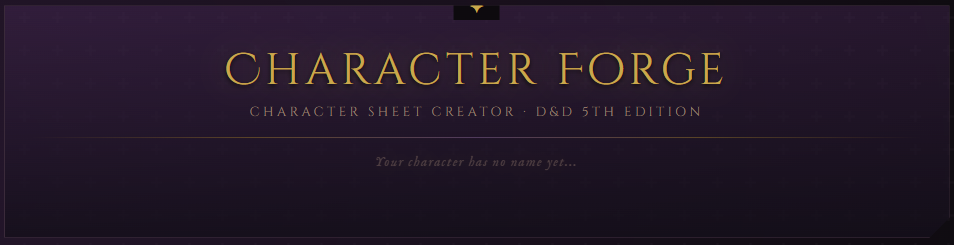
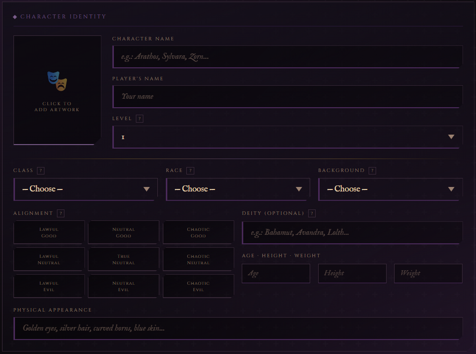
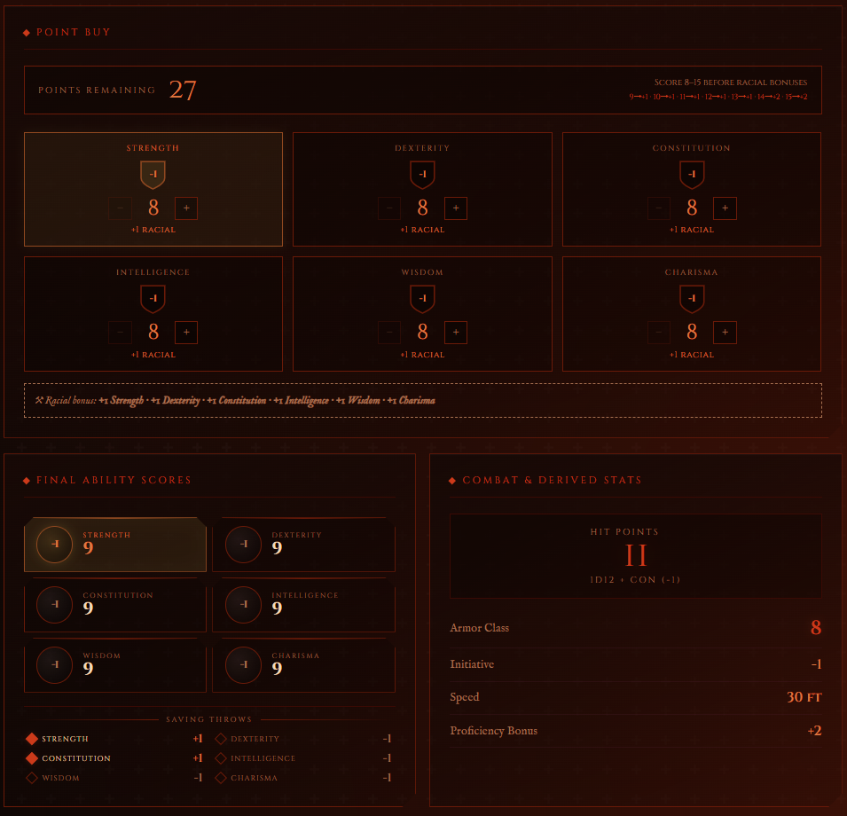
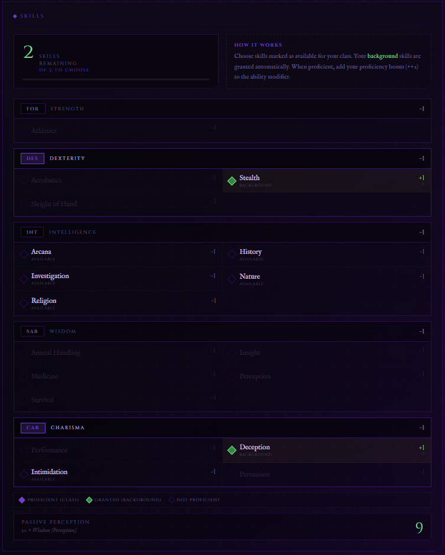
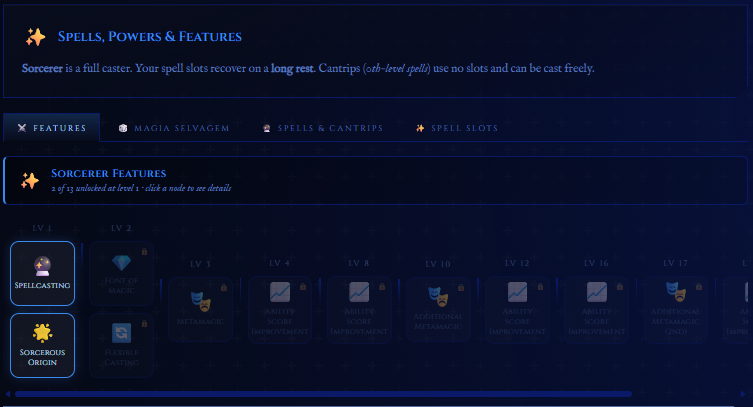
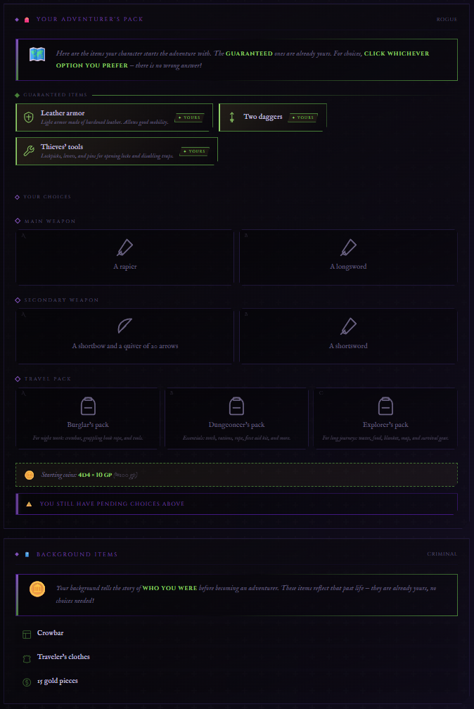
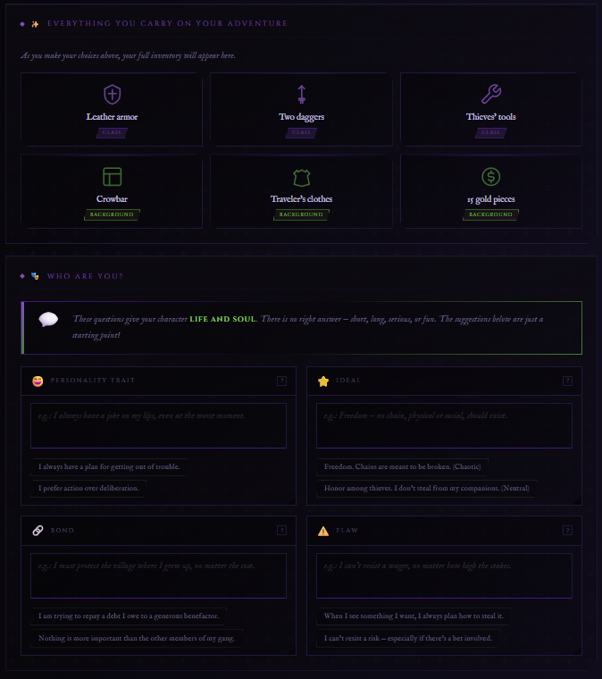
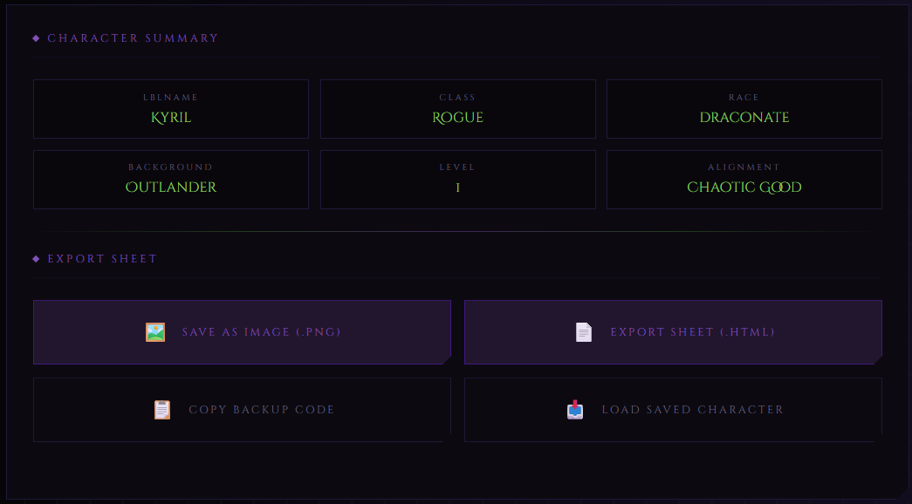

# Character Forge

<p align="center">
  
</p>

<p align="center">
  <strong>An interactive Dungeons & Dragons 5th Edition character creator built with HTML, CSS and Vanilla JavaScript.</strong>
</p>

<p align="center">
  Create, manage, and customize D&D 5e characters through an intuitive interface featuring automatic calculations, equipment management, spell tracking, multilingual support, and character backup functionality.
</p>

---

## Overview

Character Forge is a browser-based character sheet creator designed to streamline the Dungeons & Dragons 5th Edition character creation process.

The project combines detailed customization options with automatic calculations and dynamic updates, allowing players to focus on building and managing their characters instead of handling repetitive manual calculations.

No installation, frameworks, or external dependencies are required.

---

## Features

### Character Creation

* Character identity management
* Race selection
* Class selection
* Subclass support
* Background selection
* Alignment selection
* Avatar upload support

### Automatic Calculations

* Ability score modifiers
* Race-based bonuses
* Class-based adjustments
* Dynamic character updates
* Automatic character statistics

### Character Management

* Equipment management
* Inventory tracking
* Spell management
* Spell slot tracking
* Special ability tracking
* Character export system
* Character import system

### Accessibility

* Responsive interface
* Real-time updates
* Portuguese (PT-BR) support
* English (EN-US) support

---

## Highlights

* Fully browser-based
* No installation required
* Automatic attribute calculations
* Dynamic character sheet
* Equipment and inventory management
* Spell and ability tracking
* Character backup system
* Import and export functionality
* Multi-language support
* Built entirely with Vanilla JavaScript

---

# Screenshots

## Character Identity



The Character Identity screen allows players to define the foundation of their character, including race, class, subclass, background, alignment, and avatar customization.

---

## Attributes



Manage ability scores, modifiers, combat statistics, and character progression through automatic calculations.

*Screenshot reference: Human Barbarian, Criminal background, Path of the Berserker subclass.*

---

## Skills



Track proficiencies, bonuses, and skill-related information through a clean and organized interface.

*Screenshot reference: Human Warlock, Criminal background, The Fiend subclass.*

---

## Spells, Powers & Abilities



Track spellcasting resources, magical abilities, class features, and special powers with automatic updates.

*Screenshot reference: Human Sorcerer, Criminal background, Wild Magic subclass.*

---

## Equipment Management



Manage weapons, armor, inventory items, and equipment-related information directly from the character sheet.

*Screenshot reference: Human Rogue, Criminal background, Assassin subclass.*

---

## Equipment Management (Extended View)



Additional inventory controls and equipment organization tools for more advanced character management.

*Screenshot reference: Human Rogue, Criminal background, Assassin subclass.*

---

## Character Export & Import



Character Forge includes a complete backup system that allows players to export and restore character data quickly and efficiently.

## Live Demo

🌐 Access Character Forge online:

https://character-forge.github.io/character-forge/

### Example Character Backup

An example backup file is included with the project:

```text
Backup-Code.txt
```

To load the example character:

1. Open `Backup-Code.txt`.
2. Copy **all contents** of the file.
3. Open Character Forge.
4. Navigate to the character loading/import section.
5. Paste the entire backup code.
6. Load the character.

This example character is provided solely to demonstrate the full capabilities of the character sheet, export system, and data persistence features.

---

## Technologies

Built using:

* HTML5
* CSS3
* Vanilla JavaScript

No frameworks, libraries, build tools, or external dependencies are required.

---

## Project Structure

```text
character-forge/
│
├── assets/
│   ├── images/
│   │   └── logo.png
│   │
│   ├── icons/
│   │
│   └── screenshots/
│       ├── Identidade-Personagem_EN.png
│       ├── Atributos_EN.png
│       ├── Pericias_EN.png
│       ├── Equipamentos_EN.png
│       ├── Equipamentos-Parte2_EN.png
│       ├── Magias-Poderes-Habilidades_EN.png
│       └── Exportar-Ficha_EN.png
│
├── css/
│   └── style.css
│
├── js/
│   └── app.js
│
├── Backup-Code.txt
├── LICENSE
├── README.md
└── index.html
```

---

## Supported Content

Current support includes content from:

* Dungeons & Dragons 5th Edition
* Tasha's Cauldron of Everything

---

## Getting Started

### Run Locally

1. Download or clone the repository.
2. Open the project folder.
3. Open `index.html` in your preferred browser.

No installation or additional setup is required.

---

## Roadmap

Planned improvements include:

* Additional character customization options
* Expanded content support
* Enhanced character management tools
* Additional quality-of-life features
* Continued UI and UX improvements

---

## Disclaimer

Dungeons & Dragons and related materials are trademarks and intellectual property of Wizards of the Coast.

Character Forge is an independent educational project and is not affiliated with, endorsed by, or sponsored by Wizards of the Coast.

---

## License

Distributed under the MIT License.

See the LICENSE file for more information.

---

## Authors

Developed and maintained by the Character Forge Team.


